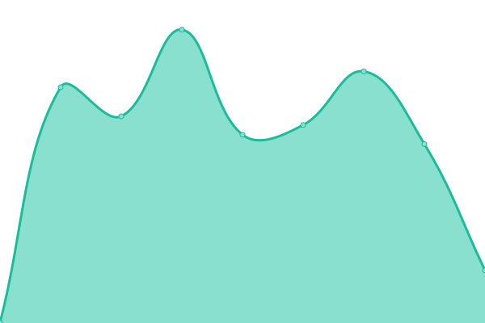

# CerberAuth Services Uptime

<!--start: status pages-->
<!-- This summary is generated by Upptime (https://github.com/upptime/upptime) -->
<!-- Do not edit this manually, your changes will be overwritten -->
<!-- prettier-ignore -->
| URL | Status | History | Response Time | Uptime |
| --- | ------ | ------- | ------------- | ------ |
|  [CerberAuth Auth](https://auth.cerberauth.com/health/ready) | 🟩 Up | [cerber-auth-auth.yml](https://github.com/cerberauth/upptime/commits/HEAD/history/cerber-auth-auth.yml) | 

 851ms
     
 | 

<a href="https://status.cerberauth.com/history/cerber-auth-auth">100.00%</a>
    

|  [CerberAuth OpenID Connect Provider](https://oauth.cerberauth.com/health/ready) | 🟩 Up | [cerber-auth-open-id-connect-provider.yml](https://github.com/cerberauth/upptime/commits/HEAD/history/cerber-auth-open-id-connect-provider.yml) | 

 777ms
     
 | 

<a href="https://status.cerberauth.com/history/cerber-auth-open-id-connect-provider">100.00%</a>
    

|  [TestID](https://testid.cerberauth.com/health/ready) | 🟩 Up | [test-id.yml](https://github.com/cerberauth/upptime/commits/HEAD/history/test-id.yml) | 

 746ms
     
 | 

<a href="https://status.cerberauth.com/history/test-id">100.00%</a>
    

|  [CerberAuth Schemas](https://schemas.cerberauth.com) | 🟩 Up | [cerber-auth-schemas.yml](https://github.com/cerberauth/upptime/commits/HEAD/history/cerber-auth-schemas.yml) | 

 180ms
     
 | 

<a href="https://status.cerberauth.com/history/cerber-auth-schemas">100.00%</a>
    

|  [CerberAuth](https://www.cerberauth.com) | 🟩 Up | [cerber-auth.yml](https://github.com/cerberauth/upptime/commits/HEAD/history/cerber-auth.yml) | 

 349ms
     
 | 

<a href="https://status.cerberauth.com/history/cerber-auth">100.00%</a>
    

|  [VulnAPI](https://vulnapi.cerberauth.com) | 🟩 Up | [vuln-api.yml](https://github.com/cerberauth/upptime/commits/HEAD/history/vuln-api.yml) | 

 303ms
     
 | 

<a href="https://status.cerberauth.com/history/vuln-api">100.00%</a>
    

|  [Nacho](https://nacho.cerberauth.com) | 🟩 Up | [nacho.yml](https://github.com/cerberauth/upptime/commits/HEAD/history/nacho.yml) | 

 274ms
     
 | 

<a href="https://status.cerberauth.com/history/nacho">100.00%</a>
    

|  [Taco](https://taco.cerberauth.com) | 🟩 Up | [taco.yml](https://github.com/cerberauth/upptime/commits/HEAD/history/taco.yml) | 

 422ms
     
 | 

<a href="https://status.cerberauth.com/history/taco">100.00%</a>
    

|  [Status Page](https://status.cerberauth.com) | 🟩 Up | [status-page.yml](https://github.com/cerberauth/upptime/commits/HEAD/history/status-page.yml) | 

 119ms
     
 | 

<a href="https://status.cerberauth.com/history/status-page">100.00%</a>
    

|  [Telemetry](telemetry.cerberauth.com) | 🟩 Up | [telemetry.yml](https://github.com/cerberauth/upptime/commits/HEAD/history/telemetry.yml) | 

 4ms
     
 | 

<a href="https://status.cerberauth.com/history/telemetry">100.00%</a>
    

<!--end: status pages-->

## 📄 License

- Code: [MIT](./LICENSE) © [Anand Chowdhary](https://anandchowdhary.com), supported by [Pabio](https://pabio.com)
- Data in the `./history` directory: [Open Database License](https://opendatacommons.org/licenses/odbl/1-0/)
